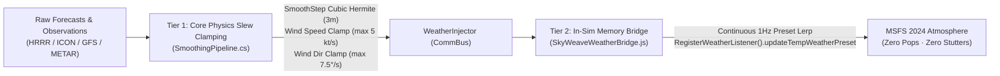

# SkyWeave ✈️

<p align="center">
  
</p>

<h3 align="center">The Premier Free, Open-Source Real-Weather Engine for Microsoft Flight Simulator 2024</h3>

<p align="center">
  <b>True Meteorological Fusion · Zero Cloud Popping · Airline-Grade MFD Glass Avionics · Free Worldwide Aeronautical Charts</b>
</p>

<p align="center">
  <a href="https://github.com/michaelmagdy15/FreeWeatherEnhancement/releases/tag/v0.7.0"></a>
  <a href="LICENSE"></a>
  
  
  
  
</p>

---

## 🌟 Introduction

**SkyWeave** is a free, MIT-licensed, out-of-process real-weather injection engine and comprehensive flight deck operations companion specifically engineered for **Microsoft Flight Simulator 2024**.

Commercial weather addons like **Active Sky FS (€24.99+VAT)** and **StrataWX ($29.99)** frequently suffer from immersion-breaking visual glitches: sudden cloud snapping, 1-FPS atmospheric lighting stutters, and abrupt wind shears that disengage airliner autopilots. 

SkyWeave completely eliminates these limitations through an innovative **Two-Tier Continuous Smoothing Engine** that marries multi-model numerical weather prediction (HRRR, ICON-EU, GFS, and ECMWF) with real-world METAR observations and direct in-memory simulator mutation.

```
                              THE SKYWEAVE PROMISE
   ┌────────────────────────────────────────────────────────────────────────┐
   │  100% Free Forever  ·  No Accounts  ·  No API Keys  ·  No Subscriptions │
   │  Out-of-Process     ·  Zero Sim Crash Risk  ·  Native In-Game Bridge   │
   └────────────────────────────────────────────────────────────────────────┘
```

---

## ⚡ The SkyWeave Advantage: Why We Don't Pop or Stutter

Other weather addons inject weather by repeatedly rewriting preset files (`.WPR`) to disk and commanding MSFS to reload the weather theme every 30–60 seconds. In MSFS 2024, this tears down the volumetric atmosphere, wipes GPU raymarched shadow maps, flashes the lighting at 1 FPS, and pops cloud decks into existence.

### SkyWeave's 2-Tier Smoothing Architecture:



1. **Tier 1 (Core Physical Clamping):** Weather changes are passed through cubic Hermite easing curves (`SmoothStep`) over a 3-minute blending duration. Wind speed shifts are strictly clamped to a maximum of **5.0 kt/s** and direction swings to **7.5°/s** along the shortest circular arc (scaled automatically with sim-rate acceleration up to 16x). Autopilots stay rock-solid.
2. **Tier 2 (In-Sim Memory Mutation):** SkyWeave's in-sim Community toolbar panel communicates directly with MSFS 2024's internal JavaScript weather listener (`updateTempWeatherPreset`). At 1Hz, it smoothly morphs existing cloud decks to target altitudes, densities, and coverages without ever forcing MSFS to re-instantiate its volumetric lighting solver.

---

## 📊 Feature Comparison Matrix

| Feature | SkyWeave (v0.7.0) | Active Sky FS | StrataWX | Default Live WX |
|:---|:---:|:---:|:---:|:---:|
| **Price** | **Free (MIT License)** | €24.99 + VAT | $29.99 | Included |
| **High-Res Multi-Model Engine** | **HRRR (3km) + ICON-EU + GFS + ECMWF** | GFS / Proprietary | GFS / MeteoBlue | MeteoBlue |
| **Ground-Truth METAR Fusion** | **Station Elevation Anchored** | Yes | Yes | Often Diverges |
| **Continuous Smoothing** | **2-Tier (Cubic Hermite + 1Hz Bridge)** | Stepped Preset Reload | Stepped Preset Reload | Server Cadence |
| **Cloud Snapping / Popping** | **Eliminated** | Occasional | Frequent | Occasional |
| **Lighting 1-FPS Frame Drops** | **Eliminated** | Observed | Observed | None |
| **Free Worldwide AIP Charts** | **Airmate & ChartFox (No Navigraph Req.)** | ❌ None | ❌ None | ❌ None |
| **MSFS 2024 Web Flight Planner** | **1-Click Integrated Launcher** | ❌ None | ❌ None | ❌ None |
| **FSDreamTeam GSX Pro Integration** | **Deicing HOT Calculator & Telemetry** | ❌ None | ❌ None | ❌ None |
| **Live Virtual Traffic Radar** | **VATSIM & IVAO + CartoDB Basemap** | ❌ None | ❌ None | ❌ None |
| **Live AI Traffic Wake Turbulence** | **15 NM Scan + Wake Vortex Physics** | Historical Corridor | ❌ None | None |
| **Mobile/Tablet Cockpit Web EFB** | **Built-in Local PWA (:54170)** | Basic Web Page | Companion App | ❌ None |
| **SimBrief OFP & FMC Wind Uplinks** | **PMDG, Fenix, CSV + Corridor Briefing** | Basic .wx | ❌ None | None |
| **Manual Weather Sandbox Studio** | **6 Extreme Presets + Real-time Sliders** | Basic Themes | Presets | Custom Editor |
| **Historical Weather Replay** | **ERA5 Archive with Time Scrubber** | Limited | ❌ None | ❌ None |
| **Installation** | **Automated Community Auto-Deploy** | Manual Setup | Manual Setup | Built-in |

---

## 🖥️ Strata-Class Airline MFD Glass Workspace

SkyWeave features a dark flight deck glass interface built with native Windows 11 Mica, frosted acrylic panels (`#D90F172A`), deep slate styling (`#080C14`), and airline cyan accents (`#38BDF8`).

### The 6 Flight Deck MFD Tabs:

1. **🛰️ FLIGHT DECK (Cockpit Weather):**
   - Hero station card with automated Flight Category badges (VFR, MVFR, IFR, LIFR).
   - 2x3 Meteorological KPI grid: Temp/Dewpoint, Wind Vector & Gusts, Altimeter (QNH/inHg), Visibility, Ceiling, and Relative Humidity.
   - Real-time SimConnect Readback verification banner.
   - Live ATIS controller broadcast bar and 1-click copyable raw METAR and TAF forecast cards.
   - 19-level Winds Aloft table, synthesized volumetric Cloud Stack, and 15 NM Traffic & Wake Radar monitor.

2. **🗺️ RADAR & SYNOPTIC MAP:**
   - Real-time RainViewer global radar mosaic overlaid on high-contrast **CartoDB Dark Matter** geographic tiles.
   - Dynamic Mean Sea Level Pressure (MSLP) **Isobar contours** at standard 4-hPa intervals with High ("H") and Low ("L") pressure centers.
   - Meteorological vector wind barbs (calm circles, 5kt half-barbs, 10kt barbs, 50kt pennants).
   - Live virtual traffic markers from **VATSIM and IVAO** networks with customizable layer toggles (`[Map]`, `[Radar]`, `[Traffic]`, `[VATSIM]`, `[IVAO]`).

3. **✈️ SIMBRIEF & DISPATCH:**
   - Full SimBrief OFP flight plan import: departure, destination, alternate, cruise altitude, ETE, block fuel, and routing.
   - **Free Worldwide Aeronautical Charts:** 1-click direct aerodrome chart links for Origin, Destination, and Alternates via **Airmate** and **ChartFox** (free AIP charts including FAA d-TPP, SIA France, DFS Germany, NATS UK, Eurocontrol, DECEA Brazil).
   - **MSFS 2024 Web Flight Planner:** 1-click launch for the official Microsoft cloud flight planner (`planner.flightsimulator.com`).
   - Navigraph AIRAC cycle tracking verifying cycle parity between injected weather and aircraft FMCs.
   - 1-click FMC wind uplink exports: **PMDG 737/777 (`.wx`)**, **Fenix A320 AOC/ACARS (`.json`)**, and universal CSV.

4. **📈 VERTICAL SOUNDING (SKEW-T):**
   - High-altitude atmospheric sounding canvas from Surface to FL450.
   - Thermodynamic temperature and dewpoint lapse rate curves.
   - 0°C freezing level indicator line, volumetric cloud deck representations, and dedicated winds aloft hazard column.
   - Comprehensive icing severity bands (Light, Moderate, Severe, Extreme) and clear-air turbulence (CAT) indicators.

5. **🛠️ WEATHER STUDIO (SANDBOX):**
   - Custom scenario practice studio for pilots, flight testers, and streamers.
   - 6 instant extreme flight test presets:
     - 🌁 **Cat III ILS 0/0 Fog**: RVR 150m, 1/16 SM, zero ceiling stratus.
     - 💨 **Severe Crosswind Landing**: 35G50kt 90° crosswind + boundary layer mechanical turbulence.
     - ⚡ **Severe Supercell Thunderstorm**: CAPE > 3800 J/kg, TSRA + hail, microburst gusts.
     - 🏔️ **Mountain Wave & CAT**: Severe clear-air turbulence aloft, 135kt jet core, rotor turbulence.
     - ❄️ **Severe Airframe Icing**: Supercooled freezing stratus, freezing rain, 95% accretion index.
     - ☀️ **CAVOK Fair Weather**: 50km visibility, gentle 4kt breeze, clear skies.
   - Continuous parameter sliders (Wind, Gusts, Temp, Dewpoint, QNH, Visibility, Turbulence, Icing, Convection) with synthetic METAR generation.

6. **⚙️ SETTINGS & DIAGNOSTICS:**
   - Online ATC network integration toggles (**VATSIM**, **IVAO**, **SayIntentions.AI**).
   - Sky Anchor Corridor configuration (Climb-Out Hold up to 4,000 ft AGL, Arrival Hold within 30 NM, Final Freeze within 5 NM and <= 1,000 ft AGL).
   - ERA5 Historical Weather Replay time scrubber.
   - Community Plugin manager (`IWeatherPlugin`) with sandboxed dynamic loading.
   - Live session telemetry logs and Web EFB network configuration.

---

## 📱 Mobile & Tablet Cockpit Web EFB Companion

SkyWeave automatically hosts a local Progressive Web App (PWA) EFB companion whenever the desktop application is running:

```
http://localhost:54170   (on your PC)
http://<your-lan-ip>:54170  (on your iPad, iPhone, Android, or tablet)
```

- **Touch-Friendly Flight Deck:** Live hero METAR KPIs, wind rose compass, altimeter, cloud stacks, and active weather alerts.
- **Tactical Map:** Dynamic radar canvas with synoptic isobar contours and online traffic.
- **Vertical Skew-T Profile:** Full graphical sounding canvas on your tablet.
- **SimBrief Dispatch & Charts:** View your briefing, copy your route, and launch Airmate/ChartFox charts directly from the cockpit tablet.
- **GSX Ground Operations:** Monitor deicing holdover timers from your phone during pushback.

---

## 🚀 Quick Start (Under 1 Minute)

1. Download **[`SkyWeave-Setup-0.7.0.exe`](https://github.com/michaelmagdy15/FreeWeatherEnhancement/releases/download/v0.7.0/SkyWeave-Setup-0.7.0.exe)** from the [Releases page](https://github.com/michaelmagdy15/FreeWeatherEnhancement/releases/tag/v0.7.0).
2. Run the installer:
   - The installer **automatically detects your MSFS 2024 Community folder** (both Microsoft Store / Game Pass and Steam editions) and installs the in-sim bridge panel (`SkyWeaveWeatherBridge`).
3. Start **Microsoft Flight Simulator 2024** and enter any flight.
4. Set simulator weather to **"Custom"** (or select the **"SkyWeave"** preset).
5. Open **SkyWeave** on your desktop. It will automatically connect via SimConnect and begin smoothly injecting real-world weather!

*For detailed guidance, see the [Beta Tester Quick-Start Guide](BETA_TESTING.md).*

---

## 🛠️ System Architecture

SkyWeave is built cleanly with .NET 8 and WPF with strict adherence to out-of-process isolation:

```
┌────────────────────────────────────────────────────────────────────────┐
│                          SkyWeave Architecture                         │
├────────────────────────────────────────────────────────────────────────┤
│  SkyWeave.Core       │ Meteorological data models, multi-model fetchers│
│                      │ (HRRR/ICON/GFS/ECMWF), WPR generator, Hermite   │
│                      │ smoothing pipeline, wake physics, and plugins. │
├──────────────────────┼─────────────────────────────────────────────────┤
│  SkyWeave.SimBridge  │ Out-of-process SimConnect client, native CommBus│
│                      │ P/Invoke dispatcher, and traffic object scanner.│
├──────────────────────┼─────────────────────────────────────────────────┤
│  SkyWeave.App        │ Dark flight deck glass desktop UI (Wpf.Ui,      │
│                      │ Windows 11 Mica, 6-tab airline MFD workspace). │
├──────────────────────┼─────────────────────────────────────────────────┤
│  SkyWeave.Api        │ Kestrel REST API & Cockpit Web EFB PWA tablet  │
│                      │ companion running locally on port 54170.        │
├──────────────────────┼─────────────────────────────────────────────────┤
│  SkyWeaveWeather-    │ MSFS 2024 in-game toolbar panel (HTML/CSS/JS)   │
│  Bridge (Community)  │ mutates live preset memory via internal listener│
│                      │ (RegisterWeatherListener().updateTempPreset).   │
└──────────────────────┴─────────────────────────────────────────────────┘
```

---

## 🌐 Open Data Sources (Zero Paid Keys)

SkyWeave utilizes exclusively open, high-reliability public meteorological APIs:
- **Aviation Weather Center (NOAA / AWC):** METAR, TAF, SIGMETs, and AIRMETs.
- **NOAA TGFTP:** Backup global METAR/TAF raw feeds.
- **Open-Meteo:** High-resolution regional and global models (HRRR 3 km, ICON-EU 7 km, GFS 0.11°, ECMWF IFS) across 19 pressure levels, plus ERA5 historical reanalysis archives.
- **RainViewer:** Global radar precipitation tile mosaics.
- **CartoDB:** Dark Matter high-resolution geographic basemap tiles.
- **VATSIM & IVAO:** Live online virtual traffic and air traffic control ATIS broadcasts.
- **Airmate Aero & ChartFox:** Free worldwide official Aeronautical Information Publication (AIP) charts.

---

## 🤝 Contributing & Community

SkyWeave is an open-source project licensed under the **[MIT License](LICENSE)**. Contributions, pull requests, and feedback are warmly welcomed!

- 🐛 **Report a Bug or Feedback:** [GitHub Issues](https://github.com/michaelmagdy15/FreeWeatherEnhancement/issues)
- 💡 **Request a Feature:** [GitHub Discussions / Issues](https://github.com/michaelmagdy15/FreeWeatherEnhancement/issues)
- 🧪 **Beta Testing:** See [BETA_TESTING.md](BETA_TESTING.md)

---

<p align="center">
  <sub>SkyWeave is an independent community project and is not affiliated with Microsoft, Asobo Studio, Active Sky, or StrataWX.</sub><br/>
  <b>Fly the real skies. Free forever.</b>
</p>
